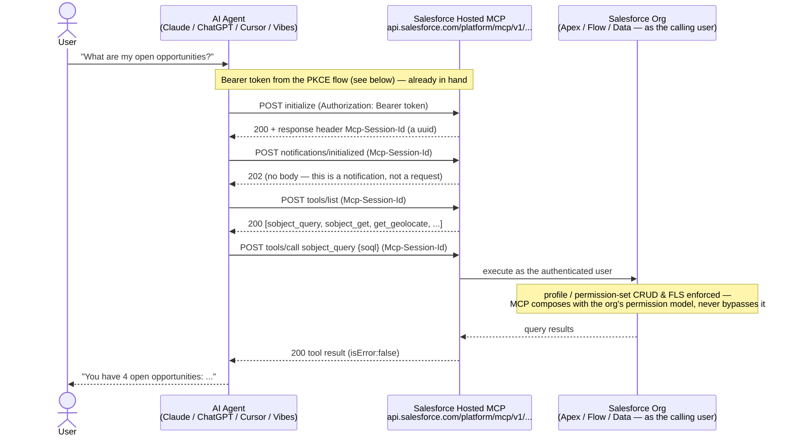

# custom-mcp-skill

**The `custom-sf-mcp` Agent Skill**, standalone — administers MCP servers inside a
Salesforce org: activates/deactivates standard MCP servers, registers custom and external MCP
servers, sets up the OAuth/PKCE client side (External Client Apps), and picks the right MCP
surface for a task.

Extracted from the [`revSkills`](https://github.com/mdhamoda) community distribution (34
`custom-rev-*` skills + `custom-sf-mcp` + friends) so this one skill can be versioned,
installed, and shared on its own. Everything below is drawn from the skill's own reference docs
(`skills/custom-sf-mcp/references/`) — `[org]` marks a claim observed against a live
Salesforce org, `[doc]` marks documented-but-unverified.

## What's in the box

| Path | What |
|---|---|
| [`skills/custom-sf-mcp/`](skills/custom-sf-mcp/) | Source form — `SKILL.md`, `scripts/`, `references/`, `assets/` |
| [`skills-packaged/custom-sf-mcp.skill`](skills-packaged/custom-sf-mcp.skill) | The same skill, zipped and ready to install |
| [`deployable-examples/salesRevOpsMcp/`](deployable-examples/salesRevOpsMcp/) | A real, 17-tool custom MCP server (Sales Rev Ops), deployable as-is with `sf` — see [below](#deployable-example--sales-rev-ops-mcp-17-tools) |
| [`claudeaiSkills/`](claudeaiSkills/) | Skills packaged for **claude.ai** (the web product) rather than a Claude Code project — see [below](#connecting-claudeai-as-an-mcp-client--and-the-ui-skill) and [`claudeaiSkills/README.md`](claudeaiSkills/README.md) |

## Install

Drop [`skills-packaged/custom-sf-mcp.skill`](skills-packaged/custom-sf-mcp.skill)
wherever your Claude Code setup loads packaged skills from, or copy
[`skills/custom-sf-mcp/`](skills/custom-sf-mcp/) directly into a project's
`.claude/skills/` directory.

---

## Deployable example — Sales Rev Ops MCP (17 tools)

[`deployable-examples/salesRevOpsMcp/`](deployable-examples/salesRevOpsMcp/) is a complete,
real custom MCP server — scrubbed and renamed from an actual org-verified deployment (API
v67.0) — meant to be deployed as-is into a real org with `sf`, not just read as reference. Every
backing type this skill covers appears at least once: `aa:` (Apex `@InvocableMethod`), `fa:`
(Autolaunched Flow), `nq:` (Named Query), and `psmcps:` (re-served standard tools).

| Tool | Backing | Needs |
|---|---|---|
| `getRepDailySummary` | `aa:` Apex (`RepDailySummaryService`) | Account/Opportunity/Task/Asset data |
| `getRecordLink` | `aa:` Apex (`GetRecordLinkService`) | nothing extra |
| `summarizeRecord` | `aa:` Apex (`SummarizeRecordService`) | nothing extra |
| `getComposeEmailLink` | `aa:` Apex (`GetComposeEmailLinkService`) | the `ComposeAndSendEmail` flow |
| `getOrUpdateRecord` | `aa:` Apex (`RecordAccessService`) | nothing extra |
| `sendCustomerEmail` | `fa:` Autolaunched Flow (`SendCustomerEmail`) | the `Customer Follow-Up` email-template folder |
| `bizApiCatalogServiceTool` (`REV000016_BizApiCatalogService`) | `aa:` Apex (`BizApiCatalogService`) | JWT self-callout |
| `productCatalogStructureServiceTool` (`REV000016_ProductCatalogStructureService`) | `aa:` Apex (`ProductCatalogStructureService`) | JWT self-callout + Revenue Cloud/PCM |
| `invokeSalesforceApiActionTool` (`REV000016_InvokeSalesforceApiAction`) | `aa:` Apex (`InvokeSalesforceApiAction`) | JWT self-callout |
| `findUserIdByEmail` | `nq:` Named Query | manual Activate in API Catalog |
| `listContactsByAccount` | `nq:` Named Query | manual Activate in API Catalog |
| `listCustomerEmailTemplates` | `nq:` Named Query | manual Activate in API Catalog |
| `getAccountInfo` | `nq:` Named Query | manual Activate in API Catalog |
| `soqlQuery`, `createSobjectRecordTool`, `updateSobjectRecordTool`, `updateRelatedRecordTool` | `psmcps:` (re-served standard tools) | none — no backing file needed at all |

Full deploy order (classes/flows/named-queries → **manually Activate each Named Query in Setup →
API Catalog** → server definition → **activate the custom server**), the JWT self-callout
prerequisite for the three `REV000016_*` tools, and what's deliberately left out, are all in
[`deployable-examples/salesRevOpsMcp/README.md`](deployable-examples/salesRevOpsMcp/README.md).

## Connecting claude.ai as an MCP client — and the UI skill

Two separate things live under this repo's `claudeaiSkills/` and connect to each other:

1. **claude.ai as an MCP *client*** — pointing claude.ai's Connectors at a hosted Salesforce MCP
   server (standard or a deployed custom one like `salesRevOpsMcp` above) so Claude can call its
   tools at all. Steps (from [`references/clients-and-troubleshooting.md` §3](skills/custom-sf-mcp/references/clients-and-troubleshooting.md#3-client-configuration)):
   1. claude.ai left sidebar → **Customize** → **Connectors** → **+** → **Add custom connector**
   2. Name it (+ optional description)
   3. **Server URL** — the server's URL per the grammar table in
      [`clients-and-troubleshooting.md` §1](skills/custom-sf-mcp/references/clients-and-troubleshooting.md)
      (e.g. `.../platform/mcp/v1/custom/SalesRevOpsExample` for the example above)
   4. **Advanced settings** → **OAuth Client ID** = the ECA's consumer key → **Add**
   5. **Connect** → redirects to the org holding the ECA to authorize
   6. Optional: **Configure** → per-tool permission settings
   7. Register `https://claude.ai/api/mcp/auth_callback` as a callback URL on the ECA (see the
      [OAuth / PKCE section](#oauth--pkce-flow--callback-urls) above for the ECA bundle itself)
2. **The `custom-salesforce-ui-workspace-generate` claude.ai *skill*** — once claude.ai can call
   the tools, this skill (in [`claudeaiSkills/`](claudeaiSkills/)) is what renders their results as
   an interactive Lightning-styled Artifact instead of a plain chat table, and includes the
   "Instructions for Claude" text to make that automatic. Full upload/enable steps and that text
   block: [`claudeaiSkills/README.md`](claudeaiSkills/README.md).

---

## MCP architecture

### Four things are called "Salesforce MCP" — disambiguate first

| Surface | Direction | Who owns it |
|---|---|---|
| **Org MCP servers** (standard / custom) | the org **hosts** tools for agents | this skill |
| External MCP servers in the API Catalog | the org **consumes** a third-party server | a different skill (`agentforce-generate`) |
| Rendering an Apex-invocable MCP tool's output | UI concern | a different skill (`platform-mcp-tool-widget-coordinate`) |
| Salesforce DX MCP Server (`@salesforce/mcp`) | local dev tooling, agent → org | **not an org feature** — it wraps the same Data/Tooling/Metadata APIs `sf` uses, nothing more |

This skill is about the first row only: **the org acting as an MCP server**, hosting tools that
an AI client (Claude, ChatGPT, Cursor, Vibes, `sf agent mcp`, ...) calls over HTTP.

### How a tool call actually flows, end-to-end

One-time OAuth/PKCE consent (next section) produces an access token; every conversation turn after
that reuses it for a stateless-looking, but session-scoped, MCP handshake:



Every request after `initialize` must echo the `Mcp-Session-Id` header — omitting it fails with
`"Session Key missing, but it's not an initialize request"`. `tools/call` is where a standard
server's SObject tool, a custom `aa:`/`fa:` Apex/Flow tool, or a `Custom`-type external-API tool
all land identically from the agent's point of view — the backing type only matters at
registration time (see the tool-backing table below), not at call time.

### The data model `[org]`

Nine MCP entities exist at API v67.0; two matter for administration:

| Entity | Role |
|---|---|
| **`McpServerAccess`** | **the activation record.** Holds `Active`. This is the whole state for a *standard* server — a server with no row has never been touched. |
| **`McpServerDefinition`** | a **custom** server's definition — deployable metadata (`mcpServerDefinitions/*.mcpServerDefinition-meta.xml`), containing nested `<tools>` and `<prompts>` elements. |
| `McpServerToolDefinition` / `PromptDefinition` / `ResourceDefinition` / `ToolApiDefinition` | runtime *projections* of a custom server's `<tools>`/`<prompts>` — not separately authored |

`McpServerAccess.McpServerId` is `null` for standard servers, **required** for custom ones — which
is exactly how the platform tells the two apart when a `DeveloperName` is posted (§ below).

⚠️ **Inactive standard servers are invisible to every API** — Metadata, Tooling, Data, Connect/REST,
and `sf agent mcp` all return nothing for a server that's never had an `McpServerAccess` row
created. Only the Setup UI lists them, which is why this skill ships a **catalog** (the table below)
and reconciles it against `McpServerAccess` for live state, rather than trying to discover servers
at runtime.

### Server URL grammar `[org]`

```
DeveloperName = <namespace>_<name with - replaced by _>
MasterLabel   = <name>                    (hyphens preserved, namespace dropped)
Server URL    = https://api.salesforce.com/platform/mcp/v1/<env>/<namespace>/<name>
```

A custom server's runtime URL is `.../platform/mcp/v1/<env>/custom/<DeveloperName>` — and its
case is preserved **exactly** as authored (`[org]`-confirmed: a mixed-case `DeveloperName` like
`salesRepMcp` is never lowercased in the real endpoint).

### Standard MCP servers — the shipped catalog `[org]` `[doc]`

Observed in a Revenue Cloud org; **availability varies by org** — `platform.*` almost always
exists, `industries.*`/`data.*` depend on which products are installed. Universal prerequisite for
every hosted server: **API v67.0+**, an ECA with the `mcp_api` scope, and an OAuth client.

| UI label | API Name | Tools | Notes |
|---|---|---:|---|
| SObject All | `platform.sobject-all` | 11 (+2 prompts) | ⚠️ includes **deletes** |
| SObject Mutations | `platform.sobject-mutations` | 9 | create/update, no delete |
| SObject Reads | `platform.sobject-reads` | 6 | read-only — safest default |
| SObject Deletes | `platform.sobject-deletes` | 8 | ⚠️ **deletes** |
| Agentforce Grid | `platform.agentforce-grid` | 51 | large context cost |
| headless-360 | `platform.headless-360` | 5 | `discover`/`describe`/`dispatch`/`dispatch_readonly` — semantic search over a growing op library; ⚠️ Beta Services terms |
| salesforce-api-context | `platform.salesforce-api-context` | 6 | |
| metadata-experts | `platform.metadata-experts` | 1 | smallest blast radius |
| engagement-interaction | `industries.engagement-interaction` | 3 | `industries` namespace |
| Data Cloud SQL | `data.data-cloud-queries` | 2 | `data` namespace |

**The CRUD slicing is deliberate** — grant least privilege by *server selection* rather than by
picking one wide server: `sobject-reads` for most agents, `sobject-mutations` when writes (never
deletes) are needed, `sobject-all`/`sobject-deletes` only when that capability is genuinely the
ask. Tools always run under **the calling user's own permissions** — MCP composes with the org's
permission model, it never bypasses it.

### Custom MCP servers — the tool-backing types `[org]`

A custom server (`McpServerDefinition`) is the only way to add your own tools, or to **combine
tools from several standard servers under one URL**. Eight backing types, each with its own
`apiIdentifier` prefix:

| Prefix | Backing | Identifier shape | Registration |
|---|---|---|---|
| `aa:` | Apex `@InvocableMethod` | `aa:apex-<ClassName>` | automatic on deploy — the class *is* the registration |
| `fa:` | Autolaunched Flow | `fa:flow-<FlowName>` | automatic on deploy |
| `psmcps:` | a standard server's tool, re-served | `psmcps:<ns>.<server>:<operation>` | constructible — no Setup click, no ESR needed |
| `ct:` | a Connect API-backed tool, re-served | `ct:<ns>-<server>_V_<ver>` | adopt-only — encoded version suffix has no confirmed derivation rule |
| `pr:` | a Prompt Builder template, exposed as a callable tool | `pr:<namespace>__<name>` | requires the template be Published |
| `ae:` | Apex `@AuraEnabled` (via `ExternalServiceRegistration`) | `ae:<ClassName>` | ⚠️ identifier confirmed, but **live invocation is currently broken** — prefer `ar:` |
| `ar:` | Apex REST `@RestResource` (via `ExternalServiceRegistration`) | `ar:<ClassName>` | confirmed working end-to-end |
| `nq:` | Named Query API (via `ApiNamedQuery` + `ExternalServiceRegistration`) | `nq:<QueryName>_nquery` | **manual**: Setup → API Catalog → Activate, every time content changes — no API path exists |

A ninth type — **`Custom`** (`registrationProviderType: Custom`) — wraps a **genuine external
REST API** (not a same-org Apex class) via a Named Credential. It gets no `apiIdentifier` prefix of
its own; reaching MCP means hand-writing an `aa:` wrapper around the platform-generated
`ExternalService.*` Apex class the deploy produces. `scripts/esr-toolkit.mjs esr custom` automates
authoring the `ExternalServiceRegistration` + Named Credential pair (see Scripts, below);
authoring the Apex wrapper stays manual because the generated method/type names are minted by the
platform *after* deploy and have to be captured from Setup's Apex Class Viewer, never guessed.

**Mandatory rule for every tool addition, of every type:** go through
`scripts/mcpserverdef-toolkit.mjs add-tool <type> ...` rather than hand-authoring a `<tools>`
block — the script performs the verification each type actually needs (confirming an `aa`/`fa`
action is really registered before wiring it, deriving `nq`'s `_nquery` suffix, adopting a real
`ct`/`psmcps` row instead of guessing). ⚠️ Editing a custom server's `<tools>`/`<prompts>` flips
`McpServerAccess.Active` back to `false` on redeploy `[org]` — re-activate after **every**
structural edit, not just the first deploy.

**MCP primitives Salesforce does *not* yet expose** for a custom `McpServerDefinition`: Resources
(the `ui://` mechanism / MCP Apps — no in-chat rendered widgets from a custom server today) and
Sampling (deprecated in the MCP spec itself, moot either way).

---

## OAuth / PKCE flow & callback URLs

Every hosted MCP server requires an **External Client App (ECA)** using OAuth **authorization
code + PKCE** — the `sf` CLI's own token cannot substitute (it belongs to `PlatformCLI`, has no
`mcp_api` scope, and hosted MCP returns `401` for it).

**PKCE (Proof Key for Code Exchange)** lets a *public* client — one that can't safely hold a
client secret, like a CLI script or a desktop agent — prove it's the same party that started the
login, without ever handling a secret. The client generates a random `code_verifier`, sends only
its SHA-256 hash (`code_challenge`) up front, and reveals the raw `code_verifier` only at the very
last step; Salesforce re-hashes it and checks the two match before issuing a token. This is exactly
what `assets/scripts/pkce-mcp-test.mjs` implements:

```mermaid
sequenceDiagram
    actor Human
    participant Client as MCP Client<br/>(pkce-mcp-test.mjs / any PKCE-capable agent)
    participant Browser
    participant SF as Salesforce<br/>login.salesforce.com or test.salesforce.com

    Client->>Client: code_verifier = base64url(random 64 bytes)
    Client->>Client: code_challenge = base64url(SHA256(code_verifier))
    Client->>Browser: open /services/oauth2/authorize ?<br/>response_type=code&amp;client_id=&lt;consumer key&gt;<br/>&amp;redirect_uri=http://localhost:1717/OauthRedirect<br/>&amp;scope=mcp_api refresh_token<br/>&amp;code_challenge=&lt;challenge&gt;&amp;code_challenge_method=S256
    Browser->>SF: GET authorize URL
    SF-->>Human: login + consent screen (RemoteAccessAuthorizationPage)
    Human->>SF: log in, click Allow
    SF-->>Browser: 302 redirect_uri?code=&lt;auth code&gt;&amp;state=...
    Browser->>Client: GET http://localhost:1717/OauthRedirect?code=...
    Note over Client: local listener on the fixed callback<br/>captures the authorization code
    Client->>SF: POST /services/oauth2/token<br/>grant_type=authorization_code&amp;code=&lt;auth code&gt;<br/>&amp;redirect_uri=...&amp;client_id=...&amp;code_verifier=&lt;verifier&gt;
    SF->>SF: SHA256(code_verifier) == code_challenge sent earlier?
    SF-->>Client: access_token + refresh_token (scope: mcp_api refresh_token)
    Client->>Client: persist token (mcp-token.json)
    Note over Client,SF: next run — grant_type=refresh_token,<br/>no browser, no human, fully headless
```

The human step (login + click Allow) happens **once**; the persisted refresh token is what makes
every later `tools/call` in the architecture diagram above possible without a browser in the loop.

### The three-file ECA bundle `[org]`

```
externalClientApps/<Name>.eca-meta.xml
extlClntAppGlobalOauthSets/<Name>.ecaGlblOauth-meta.xml     <- callback URL(s) + PKCE flag live here
extlClntAppOauthSettings/<Name>.ecaOauth-meta.xml           <- OAuth scopes
```

Deploy all three together — the global OAuth file alone fails deploy validation on its own.

Key settings on `ExtlClntAppGlobalOauthSettings`:

| Field | Value | Why |
|---|---|---|
| `isPkceRequired` | `true` | required for hosted MCP |
| `isConsumerSecretOptional` | `true` | `true` + PKCE = public-client PKCE, no client secret needed |
| `isNamedUserJwtEnabled` | `true` | **defaults `false`** on the platform — must be set explicitly |
| `callbackUrl` | client's own callback **+ `http://localhost:1717/OauthRedirect`** | see below |

🔴 **Always include `http://localhost:1717/OauthRedirect` in the callback list**, even when the
real client has its own redirect URI — multiple URLs go in **one** `<callbackUrl>` element,
newline-separated. That fixed port/path is what `assets/scripts/pkce-mcp-test.mjs` listens on; it's
the only way to validate an ECA end-to-end without depending on a specific external client's own
OAuth UI, and it's what gives Claude Code itself a working, scriptable connection path.

On `ExtlClntAppOauthSettings`, the scope value is **`MCP`** — not `mcp_api` (that's the *OAuth
scope string* a client sends at authorize-time; the metadata field wants the enum value `MCP`):

```xml
<commaSeparatedOauthScopes>MCP, RefreshToken</commaSeparatedOauthScopes>
```

### The MCP handshake `[org]` — undocumented by Salesforce, required

```
1. POST initialize                  -> 200; response header  mcp-session-id: <uuid>
2. POST notifications/initialized   -> 202   (a notification — no "id" field)
3. POST tools/list                  -> 200
4. POST tools/call                  -> 200
```

Every request after `initialize` must echo the `Mcp-Session-Id` header, or the call fails with
`"Session Key missing, but it's not an initialize request"`. Responses may arrive SSE-framed
(`data: {...}`) — strip the prefix before parsing JSON.

### End-to-end sequence — what's automatable and what isn't

```
ORG SIDE                                                          automatable?
 1. Activate the server(s)          McpServerAccess.Active=true    yes
 2. Create the ECA                  3 metadata files, MCP+RefreshToken scope   yes
 3. (harden) deploy policies        AdminApprovedPreAuthorized + shorter TTL   yes
 4. Retrieve the consumer key       from ExtlClntAppGlobalOauthSettings        yes
      ...wait: server activation ~2 min, a new ECA up to 30 min

CLIENT SIDE
 5. Register the client's callback  in the ECA (per-client URL)
 6. Configure the client            server URL + consumer key
 7. Authorize                       browser OAuth, a named human               NO — once, manually

VERIFY
 8. curl the authorize URL          302 to consent page = ECA valid            yes
 9. initialize / tools/list         handshake + inventory                      yes
10. tools/call getUserInfo          real identity JSON back, no data dependency yes
```

Only step 7 needs a human, and only once — the refresh token persists afterward, so every
subsequent run is fully headless.

### Verifying an ECA without a browser `[org]`

```bash
curl -s -o /dev/null -w "%{http_code} %{redirect_url}\n" --max-redirs 0 \
  "<INSTANCE>/services/oauth2/authorize?response_type=code&client_id=<KEY>&redirect_uri=<CB>&scope=mcp_api%20refresh_token&code_challenge=<C>&code_challenge_method=S256"
```

`302` redirecting to `RemoteAccessAuthorizationPage.apexp` = the ECA is configured correctly and
the consent screen was reached. `error=invalid_client_id` / `redirect_uri_mismatch` /
`unsupported_scope` in the response isolates a config fault before a human ever touches a browser.

---

## ECA (External Client App) support

Full spec in [`references/eca-and-testing.md`](skills/custom-sf-mcp/references/eca-and-testing.md).
Covers, beyond the OAuth/PKCE basics above:

- **All 13 ECA metadata types** and which 3 are actually required for MCP vs. auto-created vs.
  irrelevant to this surface.
- **Policy hardening** — the two auto-created policy records (`ExtlClntAppConfigurablePolicies`,
  `ExtlClntAppOauthConfigurablePolicies`) default to `permittedUsersPolicyType: AllSelfAuthorized`
  (any org user can self-authorize) and a **365-day** refresh-token lifetime — both looser than
  Salesforce's own production guidance (≤30 days; pre-authorized users only for anything beyond a
  scratch org).
- **JWT Bearer self-callout auth** — an `aa:` tool authenticating its *own* outbound callout as
  the calling user (needed because `UserInfo.getSessionId()` doesn't work inside an MCP
  `tools/call` context): a five-file ECA, the certificate-retrieval gotcha (the uploaded `.crt` is
  **not** the certificate Salesforce actually signs with — retrieve the platform's own generated
  `Certificate` metadata and use that), and scope/pre-authorization requirements — org-verified
  end-to-end with a real access token and a genuine `tools/call` round trip. Worked examples ship
  in [`assets/eca/jwt-bearer-self-callout/`](skills/custom-sf-mcp/assets/eca/jwt-bearer-self-callout/).
- **Promotion** — `McpServerAccess` is a *runtime* record, not metadata: deploying an ECA to the
  next environment carries **none** of the server activation state. Every org needs its own
  activation step, or clients fail to connect with perfectly valid credentials.

Worked ECA metadata bundles: [`assets/eca/`](skills/custom-sf-mcp/assets/eca/).

---

## Scripts

| Script | Purpose |
|---|---|
| [`scripts/esr-toolkit.mjs`](skills/custom-sf-mcp/scripts/esr-toolkit.mjs) | Authors `ExternalServiceRegistration`/`ApiNamedQuery`/`NamedCredential` backings without VS Code: `esr aura` (pulls the real OAS3 spec from the org), `esr apexrest` (deterministic reflection + placeholder schemas), `esr namedquery` (deploys the `ApiNamedQuery`, tells you to Activate manually), and `esr custom` (authors a `Custom`-type ESR + Named Credential pair for a genuine external API, from either a real OpenAPI file or synthesized placeholder operations). |
| [`scripts/mcpserverdef-toolkit.mjs`](skills/custom-sf-mcp/scripts/mcpserverdef-toolkit.mjs) | Wires a built/activated backing onto an `McpServerDefinition`'s `<tools>` list — `add-tool ae\|ar\|nq\|aa\|fa\|ct\|psmcps ...` — including the adopt-vs-construct logic each prefix needs. |
| [`assets/scripts/pkce-mcp-test.mjs`](skills/custom-sf-mcp/assets/scripts/pkce-mcp-test.mjs) | Reusable PKCE → token → MCP handshake → `tools/list`/`tools/call` test harness; listens on the fixed `localhost:1717/OauthRedirect` callback and persists the token so later runs skip re-consent. |

Both toolkit scripts write real source files under `force-app/main/default/` and dry-run validate
before any `--deploy` — nothing is ever created directly via a Tooling API poke.

## Worked examples

[`assets/mcp-server/`](skills/custom-sf-mcp/assets/mcp-server/) — a deployable custom MCP
server bundle: Apex classes (including a `Custom`-type ESR example wrapping the public
`vatcomply.com` API via a Named Credential), a Flow, the `McpServerDefinition`, and the
`ExternalServiceRegistration`/`NamedCredential` pair backing it.

## License

Apache License 2.0 — see [`LICENSE`](LICENSE) and [`NOTICE`](NOTICE). Authored by Manigandan
Dhamodaran; retain the NOTICE file and author attribution in any redistribution, per License §4.
